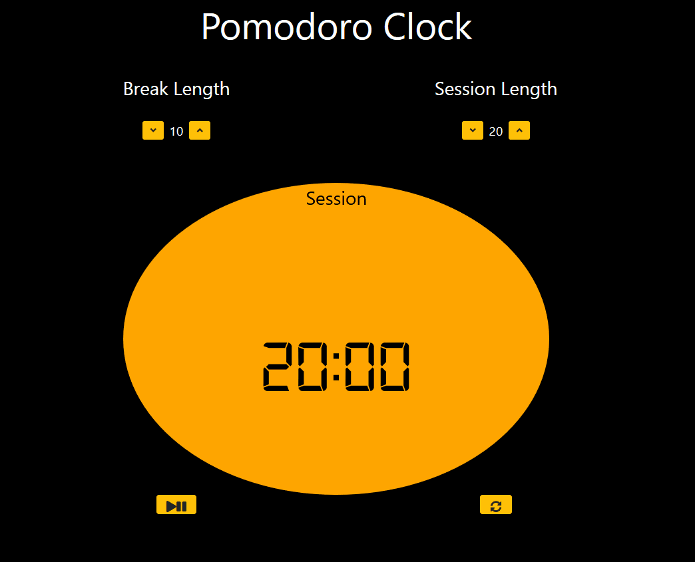

# Pomodoro clock
A Pomodoro Clock using React, made as a project for FreeCodeCamp's 'Front End Libraries' certification.

## Demo


## Installation and Usage
This app can be used by running a local server by running the following command in the root directory (with python installed):

```bash
python -m http.server
```

## License
[MIT](https://choosealicense.com/licenses/mit/)
